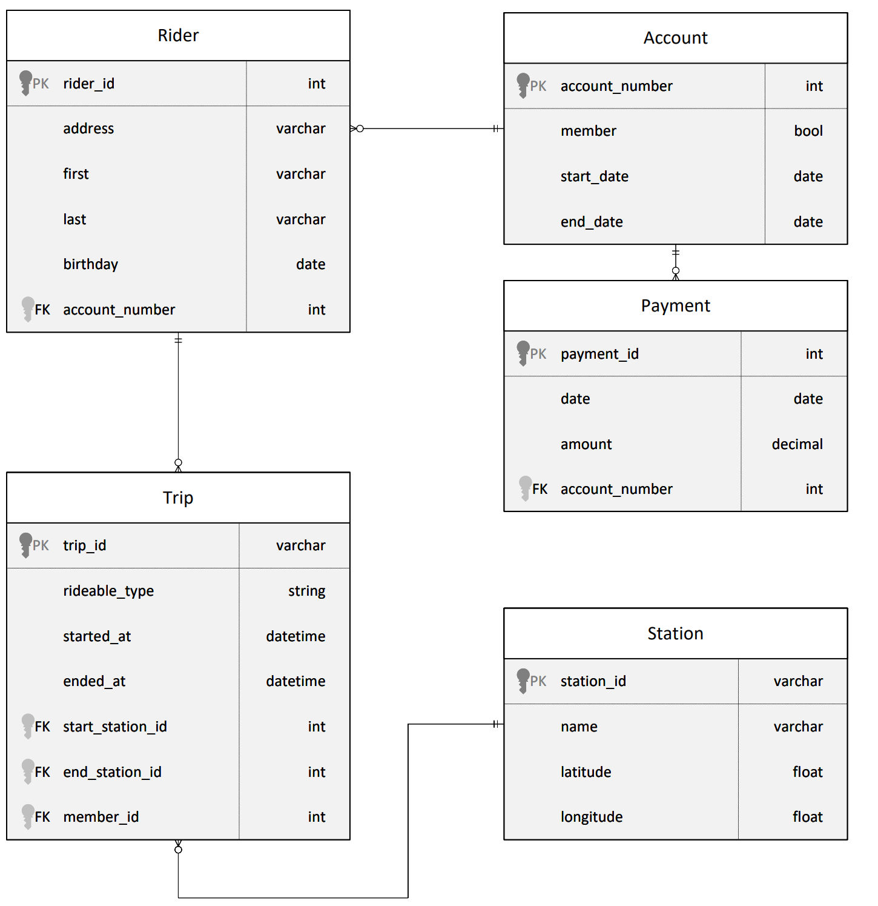

# Project Overview
Divvy is a bike sharing program in Chicago, Illinois USA that allows riders to purchase a pass at a kiosk or use a mobile application to unlock a bike at stations around the city and use the bike for a specified amount of time. The bikes can be returned to the same station or to another station. The City of Chicago makes the anonymized bike trip data publicly available for projects like this where we can analyze the data.

Since the data from Divvy are anonymous, we have created fake rider and account profiles along with fake payment data to go along with the data from Divvy. The dataset looks like this:

The goal of this project is to develop a data warehouse solution using Azure Synapse Analytics. You will:

* Design a star schema based on the business outcomes listed below;
* Import the data into Synapse;
* Transform the data into the star schema;
* and finally, view the reports from Analytics.

#### Required Analysis

The business outcomes you are designing for are as follows:

##### 1. Analyze how much time is spent per rid
* Based on date and time factors such as day of week and time of day
* Based on which station is the starting and / or ending station
* Based on age of the rider at time of the ride
* Based on whether the rider is a member or a casual rider

##### 2. Analyze how much money is spent
* Per month, quarter, year
* Per member, based on the age of the rider at account start

##### 3. EXTRA CREDIT - Analyze how much money is spent per member
* Based on how many rides the rider averages per month
* Based on how many minutes the rider spends on a bike per month

# Tasks

### Task 1 - Create your Azure resources

Task Description:
_* Create an Azure Database for PostgreSQL;_
_* Create an Azure Synapse workspace. Note that if you've previously created a Synapse Workspace, you do not need to create a second one specifically for the project;_
_* Use the built-in serverless SQL pool and database within the Synapse workspace_

To accomplish this task, was created 2 resources:
* *PostgreSQL*: A postgreSQL called `postdb-udacity-divvy`
* *Azure Synapse*: An Azure Synapse Workspace calle `asw-udacity-divvy`

[PRINT DOS RECURSOS NO RESOURCE GROUP]

### Task 2 - Design a star schema

Task Description:
_You are being provided a relational schema that describes the data as it exists in PostgreSQL. In addition, you have been given a set of business requirements related to the data warehouse. You are being asked to design a star schema using fact and dimension tables._

#### Project Data

The data provided for this project can be downloaded from [Divvy Data](https://video.udacity-data.com/topher/2022/March/622a5fc6_azure-data-warehouse-projectdatafiles/azure-data-warehouse-projectdatafiles.zip) and should be paste on `.\data\` folder.

